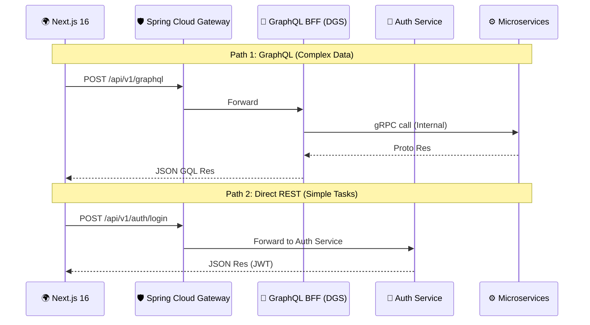
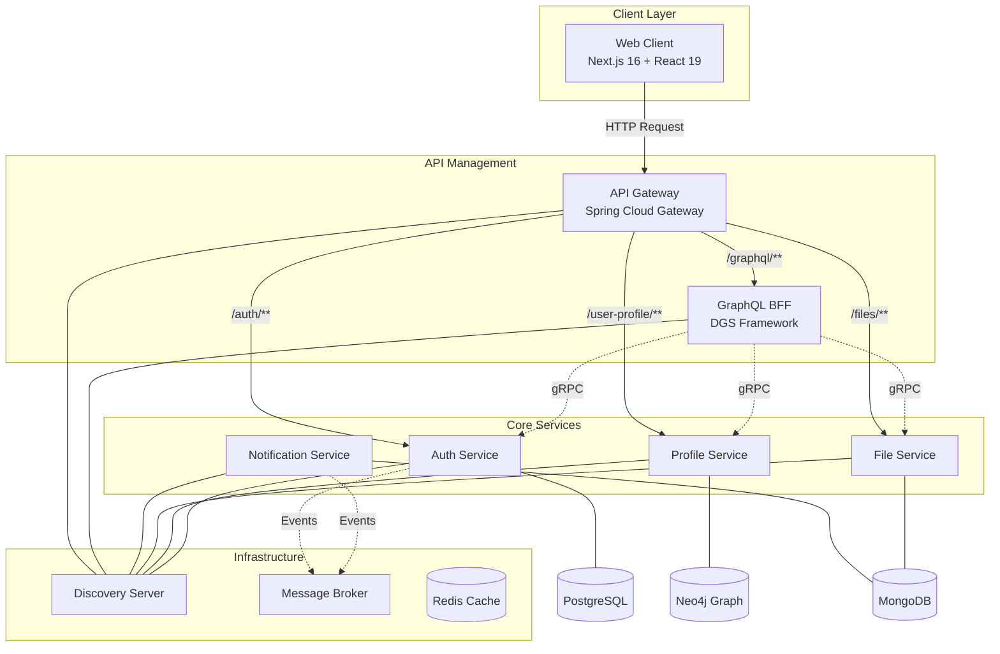

# 🌿 LeafHub - Microservices Social Platform & Tech Playground

<p align="center">
  
  
  
  
  
</p>

<p align="center">
  
</p>

LeafHub không chỉ là một mạng xã hội, mà còn là một **Tech Playground** nơi chúng mình áp dụng mô hình kiến trúc **Microservices** hiện đại nhất. Dự án được xây dựng với tinh thần **"Vừa làm vừa học"**, liên tục cập nhật và thử nghiệm các công nghệ mới nhất (Bleeding Edge) như Spring Boot 3.5+, Next.js 16+, và TailwindCSS 4.

## 📑 Mục Lục

- [🎯 Triết Lý Dự Án](#-triết-lý-dự-án)
- [🏗 Kiến Trúc & Workflow](#-kiến-trúc--workflow)
- [🛠 Tech Stack](#-tech-stack)
- [💻 Yêu Cầu Hệ Thống](#-yêu-cầu-hệ-thống)
- [🚀 Cài Đặt & Khởi Chạy](#-cài-đặt--khởi-chạy)

---

## 🎯 Triết Lý Dự Án

Dự án này tập trung vào việc khám phá và làm chủ các công nghệ mới:

- **Microservices Architecture**: Chia nhỏ hệ thống để dễ dàng mở rộng và thử nghiệm các tech stack khác nhau cho từng service.
- **Bleeding Edge Tech**: Luôn ưu tiên các version mới nhất (Alpha/Beta) để nắm bắt xu hướng tương lai.
- **Inter-service Communication**: Kết hợp linh hoạt giữa gRPC (Internal) và GraphQL (External).

---

## 🏗 Kiến Trúc & Workflow

### 1. Luồng Xử Lý Yêu Cầu (Hybrid Request Flow)

Hệ thống hỗ trợ cả hai cơ chế gọi API linh hoạt:

- **GraphQL Path**: Dùng cho tổng hợp dữ liệu từ nhiều service (Aggregation).
- **Direct REST Path**: Dùng cho Auth (Login), File Upload hoặc các tính năng CRUD đơn giản.



### 2. Sơ Đồ Hệ Thống (System Architecture)



### 3. Quy Trình Phát Triển Tính Năng (Feature Development Workflow)

Vì đây là dự án vừa làm vừa học, chúng mình áp dụng linh hoạt:

1.  **Nghiên cứu & Chọn Path**:
    - Cần aggregate dữ liệu: Chọn **GraphQL**.
    - Xử lý đơn (auth, upload): Chọn **REST**.
2.  **Triển khai Microservice**: Xây dựng logic tại service tương ứng.
3.  **Expose Interface**: Build **Controller** (REST) hoặc **gRPC Service** (để BFF gọi).
4.  **Hoàn thiện UI/UX**: Sử dụng TanStack Query để quản lý đồng bộ.

---

## 🛠 Tech Stack

### Backend Services

| Service                  | Technology                         | Database          | HTTP Port | gRPC Port |
| ------------------------ | ---------------------------------- | ----------------- | --------- | --------- |
| **Discovery Server**     | Spring Cloud Netflix Eureka        | -                 | 8761      | -         |
| **API Gateway**          | Spring Cloud Gateway               | -                 | 1000      | -         |
| **Auth Service**         | Spring Boot 3.5, Spring Security   | PostgreSQL, Redis | 1001      | 9001      |
| **File Service**         | Spring Boot 3.5, MinIO/S3          | MongoDB           | 1002      | 9002      |
| **Profile Service**      | Spring Boot 3.5, Spring Data Neo4j | Neo4j             | 1003      | 9003      |
| **Notification Service** | Spring Boot 3.5, Firebase          | MongoDB, Kafka    | 1004      | 9004      |
| **GraphQL BFF**          | Spring Boot 3.5, Netflix DGS       | -                 | 1006      | 9006      |

### Frontend

| Technology          | Version | Purpose                         |
| ------------------- | ------- | ------------------------------- |
| **Next.js**         | 16      | React Framework with App Router |
| **React**           | 19      | UI Library                      |
| **TypeScript**      | 5       | Type Safety                     |
| **TailwindCSS**     | 4       | Styling                         |
| **Zustand**         | 5       | State Management                |
| **TanStack Query**  | 5       | Server State Management         |
| **React Hook Form** | 7       | Form Handling                   |
| **Zod**             | 4       | Schema Validation               |
| **Framer Motion**   | 12      | Animations                      |
| **i18next**         | 25      | Internationalization            |

### Infrastructure

| Component                       | Technology                        |
| ------------------------------- | --------------------------------- |
| **Database**                    | PostgreSQL, Redis, MongoDB, Neo4j |
| **Message Broker**              | Apache Kafka + Zookeeper          |
| **Service Discovery**           | Netflix Eureka                    |
| **Inter-service Communication** | gRPC, REST                        |
| **API Gateway**                 | Spring Cloud Gateway              |
| **Containerization**            | Docker Compose                    |

---

## 💻 Yêu Cầu Hệ Thống

| Requirement        | Version                 |
| ------------------ | ----------------------- |
| **Java**           | 21+                     |
| **Node.js**        | 20+                     |
| **Docker**         | 24+                     |
| **Docker Compose** | 2.20+                   |
| **Maven**          | 3.9+ (hoặc dùng `mvnw`) |

---

## 🚀 Cài Đặt & Khởi Chạy

### Bước 1: Clone Repository

```bash
git clone https://github.com/canhtv05/MS.git
cd MS
```

### Bước 2: Khởi động Infrastructure (Docker)

```bash
cd .devcontainer
docker-compose up -d
```

Các services sẽ được khởi động:

- **PostgreSQL** - Port 5432
- **Redis** - Port 6379
- **MongoDB** - Port 27017
- **Neo4j** - Port 7474 (Web), 7687 (Bolt)
- **Kafka** - Port 9092
- **Zookeeper** - Port 2181

### Bước 3: Khởi động Discovery Server (Eureka)

```bash
cd discovery-server
./mvnw spring-boot:run
```

Truy cập Dashboard: http://localhost:8761

### Bước 4: Khởi động Auth Service

```bash
cd auth
$env:SPRING_PROFILES_ACTIVE='dev'; ./mvnw spring-boot:run
```

### Bước 5: Khởi động các Services khác

```bash
# Profile Service
cd profile
$env:SPRING_PROFILES_ACTIVE='dev'; ./mvnw spring-boot:run

# File Service
cd file
$env:SPRING_PROFILES_ACTIVE='dev'; ./mvnw spring-boot:run

# Notification Service
cd notification
./mvnw spring-boot:run

# GraphQL BFF
cd graphql-bff
./mvnw spring-boot:run

# API Gateway
cd gateway
./mvnw spring-boot:run
```

### Bước 6: Khởi động Web Client

```bash
cd web-client
npm install
npm run dev
```

Truy cập: http://localhost:3000

---

### Quy tắc Commit

Dự án sử dụng [Conventional Commits](https://www.conventionalcommits.org/):

```
feat: add new feature
fix: bug fix
docs: documentation changes
style: formatting, missing semicolons
refactor: code refactoring
test: adding tests
chore: maintenance tasks
```

### Coding Style

- **Java**: Google Java Style (Checkstyle)
- **TypeScript/React**: ESLint + Prettier
- Xem chi tiết tại [docs/CODE_STYLE.md](CODE_STYLE.md)

---

## 📄 License

Dự án này được phát triển bởi **canhtv05** và **nghesigia**.

---

<p align="center">
  <b>🌿 LeafHub - Connect with Nature, Connect with People 🌿</b>
</p>
