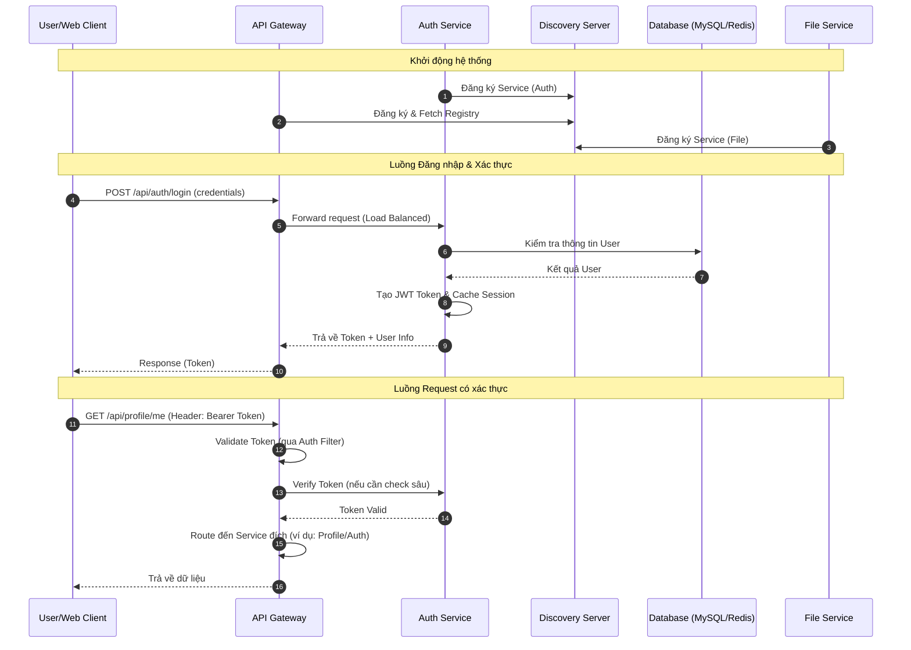

# MS Microservices System

Chào mừng bạn đến với hệ thống MS Microservices! Tài liệu này cung cấp hướng dẫn chi tiết về luồng hoạt động, cách cài đặt và chạy hệ thống, cũng như cách sử dụng Postman để kiểm thử.

## 1. Luồng Hoạt Động (Activity Flow)

Biểu đồ dưới đây mô tả luồng tương tác cơ bản giữa Client, Gateway, Auth Service và các thành phần khác trong hệ thống.



## 2. Yêu cầu hệ thống (Prerequisites)

Trước khi bắt đầu, hãy đảm bảo bạn đã cài đặt các công cụ sau:

- **Java 17+**: Để chạy các microservices (Spring Boot).
- **Maven**: Để build và quản lý dependencies (có thể dùng `mvnw` có sẵn).
- **Docker & Docker Compose**: Để chạy Database (MySQL, Redis, MongoDB).
- **Node.js & npm**: Để chạy Web Client (Next.js).
- **Postman**: Để import collection và test API.
- **Git**: Để clone source code.

## 3. Cài đặt & Khởi chạy (Installation & Running)

Thực hiện lần lượt các bước sau để khởi động toàn bộ hệ thống.

### Bước 1: Khởi chạy Discovery Server (Eureka)

Đây là trái tim của hệ thống, nơi các service khác đăng ký.

```powershell
cd discovery-server
.\mvnw.cmd spring-boot:run
```

_Truy cập Dashboard:_ `http://localhost:8761`

### Bước 2: Khởi chạy Database (Docker)

Sử dụng Docker Compose để bật MySQL, Redis và các DB cần thiết.

```powershell
cd .devcontainer
docker-compose up -d
```

_Kiểm tra:_ Chạy `docker ps` để đảm bảo các container đã running.

### Bước 3: Khởi chạy Auth Service

Service chịu trách nhiệm xác thực và phân quyền.

```powershell
cd auth
.\mvnw.cmd spring-boot:run
```

_Lưu ý:_ Đợi vài giây để service đăng ký thành công với Eureka.

### Bước 4: Khởi chạy API Gateway

Cổng vào duy nhất cho mọi request từ client.

```powershell
cd gateway
.\mvnw.cmd spring-boot:run
```

### Bước 5: Khởi chạy các Service khác (Tùy chọn)

Ví dụ: File Service.

```powershell
cd file
.\mvnw.cmd spring-boot:run
```

### Bước 6: Khởi chạy Web Client (Frontend)

Giao diện người dùng được xây dựng bằng Next.js.

```powershell
cd web-client
npm install
npm run dev
```

_Truy cập Web:_ `http://localhost:3000`

---

## 4. Hướng dẫn Postman (Postman Collection)

Repo cung cấp sẵn bộ Collection đầy đủ để bạn test API ngay lập tức.

### Vị trí file

- **Collection**: `docs/postman/MS.postman_collection.json`
- **Environment**: `docs/postman/MS.postman_environment.json`

### Cách sử dụng

1.  Mở **Postman**.
2.  Nhấn nút **Import** (góc trên bên trái).
3.  Kéo thả hoặc chọn 2 file JSON ở đường dẫn trên vào.
4.  Sau khi import thành công:
    - Chọn Environment là **MS** (hoặc tên tương tự trong file env) ở góc trên bên phải.
    - Mở Collection **MS** bên thanh sidebar.
5.  **Bắt đầu test**:
    - Chạy request **Login** trước để lấy Token.
    - Token thường sẽ được tự động lưu vào Environment Variable (nếu script test đã được cấu hình sẵn trong Collection). Nếu không, hãy copy `accessToken` từ response và paste vào biến môi trường `token` hoặc tab **Auth** của các request khác.

### Lưu ý khi test

- Đảm bảo **Gateway** và **Auth Service** đang chạy.
- Nếu gặp lỗi 401/403, hãy kiểm tra lại Token.
- Nếu gặp lỗi kết nối, hãy kiểm tra lại Docker và Eureka.

---

## 5. Cấu trúc dự án (Project Structure)

- `discovery-server`: Eureka Server.
- `gateway`: Spring Cloud Gateway.
- `auth`: Authentication Service (JWT, OAuth2).
- `file`: File Management Service.
- `common-object`: Shared DTOs, Protos.
- `web-client`: Next.js Frontend.
- `.devcontainer`: Docker config cho môi trường Dev.
- `docs`: Tài liệu và Postman Collection.

---

_Chúc bạn cài đặt và phát triển thành công!_
