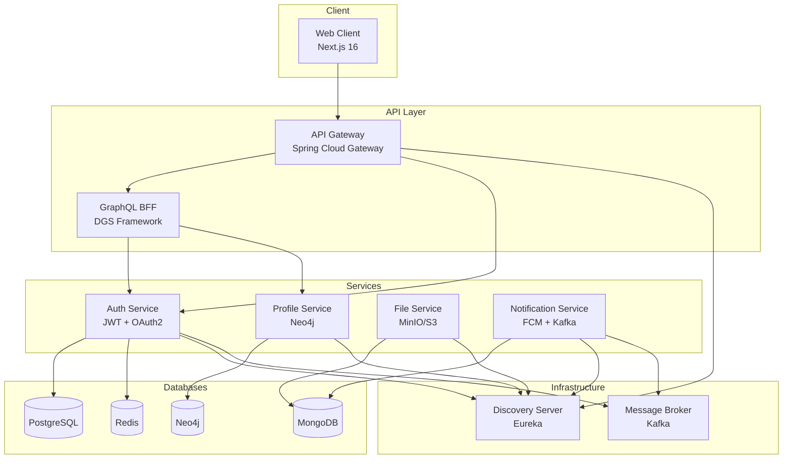

# 🌿 LeafHub - Microservices Social Platform

<p align="center">
  
  
  
  
  
</p>

LeafHub là một nền tảng mạng xã hội được xây dựng theo kiến trúc **Microservices**, sử dụng các công nghệ hiện đại như Spring Boot, Next.js, GraphQL, gRPC, và Kafka.

## 📑 Mục Lục

- [Tính Năng](#-tính-năng)
- [Kiến Trúc Hệ Thống](#-kiến-trúc-hệ-thống)
- [Tech Stack](#-tech-stack)
- [Cấu Trúc Dự Án](#-cấu-trúc-dự-án)
- [Yêu Cầu Hệ Thống](#-yêu-cầu-hệ-thống)
- [Cài Đặt & Khởi Chạy](#-cài-đặt--khởi-chạy)
- [API Documentation](#-api-documentation)
- [Đóng Góp](#-đóng-góp)

---

## ✨ Tính Năng

### 🔐 Authentication & Authorization

- Đăng nhập / Đăng ký với email verification
- JWT Token với refresh token mechanism
- OAuth2 integration
- Role-based access control (RBAC)
- Two-factor authentication (OTP)

### 👤 Profile Management

- Quản lý thông tin cá nhân
- Upload và crop avatar/cover image
- Media history tracking
- Privacy settings (Public, Friends Only, Private)

### 💬 Social Features

- Bài viết (Posts)
- Theo dõi (Follow/Unfollow)
- Danh sách bạn bè
- Thông báo real-time

### 🌐 Internationalization

- Hỗ trợ đa ngôn ngữ (Vietnamese, English)
- i18next integration

---

## 🏗 Kiến Trúc Hệ Thống



---

## 🛠 Tech Stack

### Backend Services

| Service                  | Technology                         | Database          | HTTP Port | gRPC Port |
| ------------------------ | ---------------------------------- | ----------------- | --------- | --------- |
| **Discovery Server**     | Spring Cloud Netflix Eureka        | -                 | 8761      | -         |
| **API Gateway**          | Spring Cloud Gateway               | -                 | 1000      | -         |
| **Auth Service**         | Spring Boot 3.5, Spring Security   | PostgreSQL, Redis | 1001      | 9001      |
| **File Service**         | Spring Boot 3.5, MinIO/S3          | MongoDB           | 1002      | 9002      |
| **Profile Service**      | Spring Boot 3.5, Spring Data Neo4j | Neo4j             | 1003      | 9003      |
| **Notification Service** | Spring Boot 3.5, Firebase          | MongoDB, Kafka    | 1004      | 9004      |
| **GraphQL BFF**          | Spring Boot 3.5, Netflix DGS       | -                 | 1006      | 9006      |

### Frontend

| Technology          | Version | Purpose                         |
| ------------------- | ------- | ------------------------------- |
| **Next.js**         | 16      | React Framework with App Router |
| **React**           | 19      | UI Library                      |
| **TypeScript**      | 5       | Type Safety                     |
| **TailwindCSS**     | 4       | Styling                         |
| **Zustand**         | 5       | State Management                |
| **TanStack Query**  | 5       | Server State Management         |
| **React Hook Form** | 7       | Form Handling                   |
| **Zod**             | 4       | Schema Validation               |
| **Framer Motion**   | 12      | Animations                      |
| **i18next**         | 25      | Internationalization            |

### Infrastructure

| Component                       | Technology                        |
| ------------------------------- | --------------------------------- |
| **Database**                    | PostgreSQL, Redis, MongoDB, Neo4j |
| **Message Broker**              | Apache Kafka + Zookeeper          |
| **Service Discovery**           | Netflix Eureka                    |
| **Inter-service Communication** | gRPC, REST                        |
| **API Gateway**                 | Spring Cloud Gateway              |
| **Containerization**            | Docker Compose                    |

---

## 📁 Cấu Trúc Dự Án

```
MS/
├── 📂 auth/                    # Authentication Service
│   └── src/main/java/com/leaf/auth/
│       ├── config/             # Security, JWT, OAuth2 configs
│       ├── controller/         # REST endpoints
│       ├── domain/             # Entities
│       ├── dto/                # Data Transfer Objects
│       ├── grpc/               # gRPC server/client
│       ├── repository/         # Data access layer
│       ├── security/           # Security filters, providers
│       └── service/            # Business logic
│
├── 📂 profile/                 # Profile Service (Neo4j)
│   └── src/main/java/com/leaf/profile/
│       ├── domain/             # Neo4j Node entities
│       ├── grpc/               # gRPC communication
│       └── service/            # Profile, MediaHistory services
│
├── 📂 file/                    # File Management Service
│   └── src/main/java/com/leaf/file/
│       ├── service/            # File upload, storage
│       └── grpc/               # gRPC file transfer
│
├── 📂 notification/            # Notification Service
│   └── src/main/java/com/leaf/noti/
│       ├── config/             # Kafka, Firebase configs
│       └── service/            # Email, Push notification
│
├── 📂 graphql-bff/             # GraphQL Backend-for-Frontend
│   └── src/main/java/com/leaf/graphql_bff/
│       ├── auth/               # GraphQL resolvers, types
│       └── security/           # GraphQL security
│
├── 📂 gateway/                 # API Gateway
│   └── src/main/java/com/leaf/gateway/
│       └── config/             # Routes, filters, security
│
├── 📂 discovery-server/        # Eureka Server
│
├── 📂 common/                  # Shared utilities
│   └── src/main/java/com/leaf/common/
│       ├── dto/                # Shared DTOs
│       ├── exception/          # Common exceptions
│       └── util/               # Utilities
│
├── 📂 framework/               # Framework module
│   └── Security, Redis, Exception handling
│
├── 📂 web-client/              # Next.js Frontend
│   ├── app/                    # App Router pages
│   │   ├── (auth)/             # Auth pages (login, register)
│   │   └── (home)/             # Protected pages
│   ├── components/             # React components
│   │   ├── animate-ui/         # Animated UI primitives
│   │   └── customs/            # Custom components
│   ├── services/               # API services
│   │   ├── mutations/          # TanStack mutations
│   │   └── queries/            # TanStack queries
│   ├── stores/                 # Zustand stores
│   ├── types/                  # TypeScript types
│   ├── locale/                 # i18n translations
│   └── views/                  # Page components
│
├── 📂 .devcontainer/           # Docker Compose configs
├── 📂 docs/                    # Documentation
└── 📄 package.json             # Root package (linting, formatting)
```

---

## 💻 Yêu Cầu Hệ Thống

| Requirement        | Version                 |
| ------------------ | ----------------------- |
| **Java**           | 21+                     |
| **Node.js**        | 20+                     |
| **Docker**         | 24+                     |
| **Docker Compose** | 2.20+                   |
| **Maven**          | 3.9+ (hoặc dùng `mvnw`) |

---

## 🚀 Cài Đặt & Khởi Chạy

### Bước 1: Clone Repository

```bash
git clone https://github.com/canhtv05/MS.git
cd MS
```

### Bước 2: Khởi động Infrastructure (Docker)

```bash
cd .devcontainer
docker-compose up -d
```

Các services sẽ được khởi động:

- **PostgreSQL** - Port 5432
- **Redis** - Port 6379
- **MongoDB** - Port 27017
- **Neo4j** - Port 7474 (Web), 7687 (Bolt)
- **Kafka** - Port 9092
- **Zookeeper** - Port 2181

### Bước 3: Khởi động Discovery Server (Eureka)

```bash
cd discovery-server
./mvnw spring-boot:run
```

Truy cập Dashboard: http://localhost:8761

### Bước 4: Khởi động Auth Service

```bash
cd auth
$env:SPRING_PROFILES_ACTIVE='dev'; ./mvnw spring-boot:run
```

### Bước 5: Khởi động các Services khác

```bash
# Profile Service
cd profile
$env:SPRING_PROFILES_ACTIVE='dev'; ./mvnw spring-boot:run

# File Service
cd file
$env:SPRING_PROFILES_ACTIVE='dev'; ./mvnw spring-boot:run

# Notification Service
cd notification
./mvnw spring-boot:run

# GraphQL BFF
cd graphql-bff
./mvnw spring-boot:run

# API Gateway
cd gateway
./mvnw spring-boot:run
```

### Bước 6: Khởi động Web Client

```bash
cd web-client
npm install
npm run dev
```

Truy cập: http://localhost:3000

---

## 📖 API Documentation

### Postman Collection

Import các file sau vào Postman:

- `docs/postman/MS.postman_collection.json`
- `docs/postman/MS.postman_environment.json`

### GraphQL Playground

Truy cập: http://localhost:8080/graphiql

### API Endpoints

| Method | Endpoint                  | Description                 |
| ------ | ------------------------- | --------------------------- |
| POST   | `/api/auth/login`         | Đăng nhập                   |
| POST   | `/api/auth/register`      | Đăng ký                     |
| POST   | `/api/auth/refresh-token` | Làm mới token               |
| GET    | `/api/profile/me`         | Lấy thông tin user hiện tại |
| PUT    | `/api/profile/update`     | Cập nhật profile            |
| POST   | `/api/profile/avatar`     | Upload avatar               |
| POST   | `/api/profile/cover`      | Upload cover image          |
| GET    | `/api/profile/{username}` | Lấy profile theo username   |

---

## 🤝 Đóng Góp

Vui lòng đọc [CONTRIBUTING.md](../CONTRIBUTING.md) để biết chi tiết về quy trình đóng góp.

### Quy tắc Commit

Dự án sử dụng [Conventional Commits](https://www.conventionalcommits.org/):

```
feat: add new feature
fix: bug fix
docs: documentation changes
style: formatting, missing semicolons
refactor: code refactoring
test: adding tests
chore: maintenance tasks
```

### Coding Style

- **Java**: Google Java Style (Checkstyle)
- **TypeScript/React**: ESLint + Prettier
- Xem chi tiết tại [docs/CODE_STYLE.md](CODE_STYLE.md)

---

## 📄 License

Dự án này được phát triển bởi **canhtv05** và **nghesigia**.

---

<p align="center">
  <b>🌿 LeafHub - Connect with Nature, Connect with People 🌿</b>
</p>
